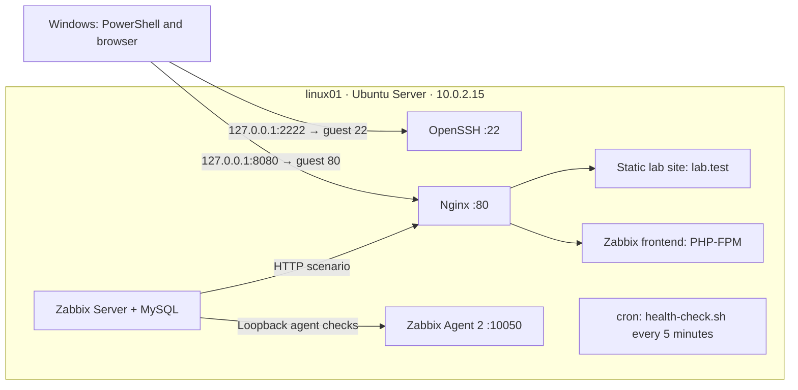
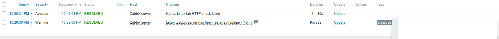

# Linux Administration & Monitoring Lab

A practical Ubuntu home lab for developing Linux administration, monitoring, and troubleshooting skills for junior infrastructure and support roles.

**Status:** Core exercises completed and verified. Five controlled failures were diagnosed and resolved, and a Bash health check runs every five minutes through cron. Results describe the recorded lab tests, not a live service status.

## Architecture

One Ubuntu VM runs the services and monitoring stack. Windows reaches it through VirtualBox NAT port forwarding.

**Verified stack:** Ubuntu Server 26.04.1 LTS, VirtualBox, OpenSSH, systemd, UFW, Nginx, MySQL, PHP-FPM, Zabbix 7.0.31, Bash, and cron. Ubuntu and Zabbix were already installed when the documented work began.

## Implemented and Verified

- **Administration:** package upgrade and reboot checks, hostname change, sudo access, users/groups, setgid directory, and permission tests.
- **SSH and firewall:** Ed25519 login, password-only login rejection, root login disabled in configuration, and UFW allowing guest TCP ports 22 and 80.
- **Nginx:** static site selected by `Host: lab.test`, configuration validation, reload, HTTP checks, and access/error log inspection.
- **Monitoring:** system name, uptime, CPU, RAM, root filesystem, and network traffic collected under the Zabbix host `Zabbix server`, which monitors `linux01` through loopback.
- **Alerting:** agent-availability trigger and a custom HTTP trigger verified through problem and recovery events.

## Troubleshooting Scenarios

| Failure | Diagnosis and correction | Recovery evidence |
| --- | --- | --- |
| [Group write denied](docs/02-users-and-permissions.md#controlled-permission-failure-group-write-denied) | Inspected ownership/mode; added the missing group-write bit | Group member wrote successfully; outsider still denied |
| [Firewall blocked HTTP](docs/04-networking-and-firewall.md#controlled-http-blocking-scenario) | Local HTTP worked; UFW DROP counter increased; removed temporary deny rule | Windows HTTP `200`, curl exit `0` |
| [Agent 2 stopped](docs/06-zabbix-monitoring.md#agent-availability-exercise-detection-and-recovery) | Checked service journal; started the agent | Fresh uptime data and resolved availability event |
| [Nginx stopped](docs/05-nginx.md#controlled-nginx-outage) | Used systemctl and journalctl; started Nginx | HTTP `200` and resolved custom HTTP event |
| [DNS lookup timed out](docs/04-networking-and-firewall.md#controlled-dns-failure-and-recovery) | Numeric IP ping worked; restored the original DNS server list | `ubuntu.com` resolved again, exit `0` |

## Automation

The [health-check script](scripts/health-check.sh) checks Nginx activity, root filesystem usage, memory usage, and ICMP reachability of `1.1.1.1`. Disk and memory thresholds are 80%. It runs every check and returns `1` if any fail, otherwise `0`.

Timestamped reports are appended to a log by the invoking shell. The installed user crontab runs every five minutes as `matt`; matching journal and log entries confirm an automatic run. [Tests and cron configuration](docs/07-bash-automation.md) cover normal operation, missing units, lowered thresholds, invalid measurements, and failed ICMP.

## Scope

Monitoring runs on the same VM as the services; whole-VM outage detection from another machine is not demonstrated. The Bash script checks service state and numeric ICMP, so HTTP and DNS require separate checks. The web endpoint uses HTTP in this NAT lab, and `lab.test` is selected using a Host header rather than configured DNS. The unidentified old Zabbix host `matt` is retained with monitoring disabled.

## Documentation

1. [Server setup and upgrade verification](docs/01-server-setup.md)
2. [Users, groups, and permissions](docs/02-users-and-permissions.md)
3. [SSH keys and authentication hardening](docs/03-ssh.md)
4. [Networking, firewall, and DNS troubleshooting](docs/04-networking-and-firewall.md)
5. [Nginx configuration and outage diagnosis](docs/05-nginx.md)
6. [Zabbix metrics, triggers, and recovery](docs/06-zabbix-monitoring.md)
7. [Bash health check, tests, and cron](docs/07-bash-automation.md)
